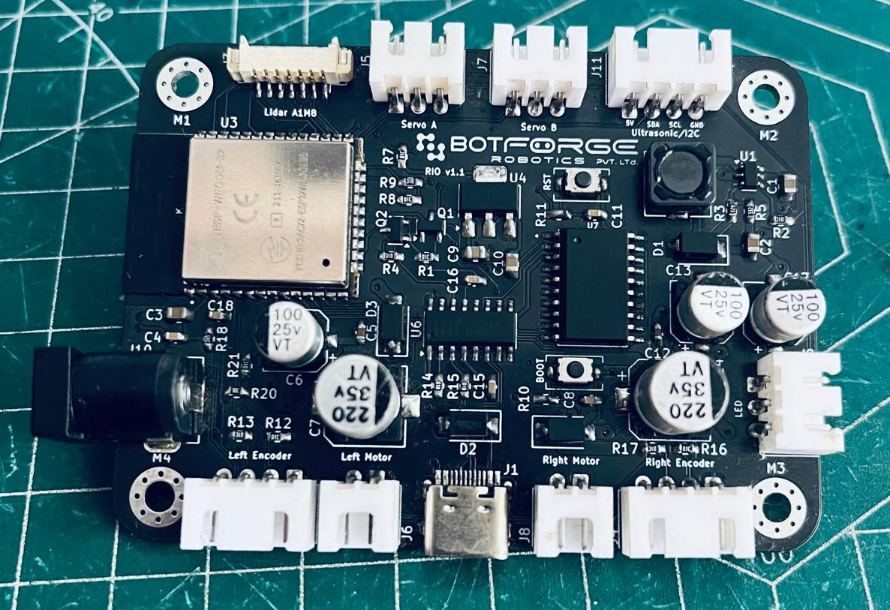

<div align="center">
    &nbsp;
    &nbsp;
    &nbsp;
    &nbsp;
    
</div>

<h2 align="center">RIO Controller Firmware</h2>

<div style="text-align: center; margin: 20px;">
    
</div>

## 🛠 Prerequisites

### Hardware
- RIO Controller Board
- Type-C USB Cable

### Software
- [Visual Studio Code](https://code.visualstudio.com/)
- [PlatformIO Extension](https://platformio.org/)
- [CH340 USB Driver](https://sparks.gogo.co.nz/ch340.html)

## 🚀 Quick Setup

### 1. Development Environment
1. **Install Visual Studio Code**
2. **Install PlatformIO Extension**
   - Open VSCode Extensions (Ctrl+Shift+X)
   - Search for "PlatformIO"
   - Click "Install"

### 2. Project Installation
```bash
# Clone the repository
git clone https://github.com/botforge-robotics/rio_firmware.git
cd rio_firmware

# Open in VSCode
code .
```

## 🔧 Configuration

### Network Settings
Modify `src/main.cpp` with your network details:

```cpp
// WiFi Configuration
char ssid[] = "YourWiFiNetworkName";     // Your WiFi Network Name
char psk[] = "YourWiFiPassword";         // Your WiFi Password

// Static IP Configuration
IPAddress agent_ip(192, 168, 0, 121);    // Desired Static IP
size_t agent_port = 8888;                // Communication Port
```

## 💻 Deployment

### Flashing Firmware
1. Connect RIO PCB via USB
2. In VSCode, use PlatformIO:
   - Click "Upload" (➡️ icon)
   - Or use Terminal: `platformio run -t upload`


## Related Repositories
- 🔧 [RIO Harware](https://github.com/botforge-robotics/rio_hardware) - RIO robot hardware parts and assembly
- 🤖 [RIO ROS2](https://github.com/botforge-robotics/rio_ros2) - ROS2 packages for navigation, control, and sensor integration


## 🔍 Troubleshooting
### Common Issues
- ❗ Incorrect COM Port
- ❗ Driver Problems
- ❗ Network Configuration Errors

### Diagnostic Commands
```bash
# List Connected Devices
platformio device list

# Monitor Serial Output
platformio device monitor
```


## 🤝 Contributing
1. Fork the Repository
2. Create Feature Branch
3. Commit Changes
4. Push to Branch
5. Open Pull Request

---